<!--
  Profile HUD. Every panel is generated by hud/build.py from hud/config.json
  plus live GitHub data, and refreshed daily by .github/workflows/intel.yml.
-->

  

<a href="#briefing"></a><a href="#loadout"></a><a href="#killstreaks"></a><a href="#record"></a><a href="#squad"></a>

  

  

  

  
  
  <a href="mailto:niteshkadian0668@gmail.com"></a>
  <a href="https://www.linkedin.com/in/niteshkadian"></a>
  <a href="https://discord.gg/yVsNKkY95N"></a>

  <a href="#briefing"></a>

  Fan-made HUD inspired by Call of Duty: Modern Warfare. Not affiliated with or endorsed by Activision. Stats are live from the GitHub API and refresh daily.

