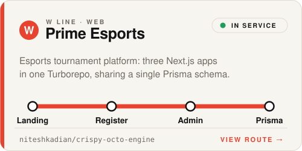
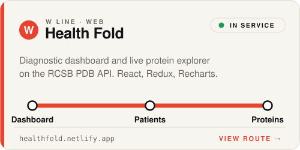
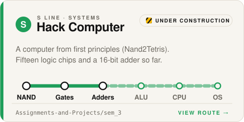
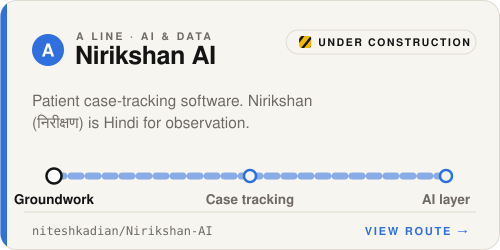
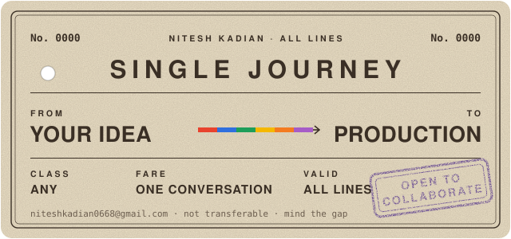

<!--
  This profile is a transit system.
  The departure board rebuilds itself from the GitHub API (.github/workflows/departures.yml).
  To change anything, edit station/routes.json and run: python station/build.py
-->

  

  <a href="https://somentm.com"><b>SomenTm</b></a>
  &nbsp;&nbsp;·&nbsp;&nbsp;
  <a href="mailto:niteshkadian0668@gmail.com">Email</a>
  &nbsp;&nbsp;·&nbsp;&nbsp;
  <a href="https://www.linkedin.com/in/niteshkadian">LinkedIn</a>
  &nbsp;&nbsp;·&nbsp;&nbsp;
  <a href="https://discord.gg/yVsNKkY95N">Discord</a>

 

I'm **Nitesh**, a computer science student who works across the whole stack. I mean the *whole* stack: this semester I'm wiring a computer together out of NAND gates, and recently I shipped an esports platform as three Next.js apps on a single Turborepo. I do my best work somewhere between those two altitudes.

These days I'm building at **[SomenTm](https://somentm.com)**, which makes software for mobility and connected services. That's fitting, given the map below.

 

<picture>
  <source media="(prefers-color-scheme: dark)" srcset="assets/map-dark.svg">
  
</picture>

  <a href="https://github.com/niteshkadian/crispy-octo-engine"><picture><source media="(prefers-color-scheme: dark)" srcset="assets/route-prime-esports-dark.svg"></picture></a>
  <a href="https://healthfold.netlify.app"><picture><source media="(prefers-color-scheme: dark)" srcset="assets/route-health-fold-dark.svg"></picture></a>

  <a href="https://github.com/niteshkadian/Assignments-and-Projects/tree/main/sem_3/Nand2Tetris_Nitesh"><picture><source media="(prefers-color-scheme: dark)" srcset="assets/route-hack-computer-dark.svg"></picture></a>
  <a href="https://github.com/niteshkadian/Nirikshan-AI"><picture><source media="(prefers-color-scheme: dark)" srcset="assets/route-nirikshan-ai-dark.svg"></picture></a>

 

  

  The board at the top rebuilds itself from the GitHub API every few hours &nbsp;·&nbsp; <a href="station/routes.json">timetable</a> &nbsp;·&nbsp; mind the gap

